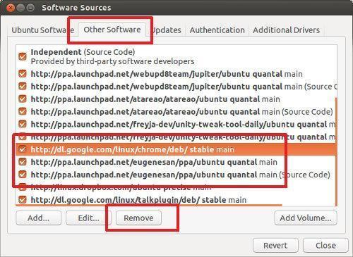

> 原文连接: [Using PPA in Ubuntu Linux](https://itsfoss.com/ppa-guide/)

# 在 Ubuntu Linux 中使用 PPA

> 最后更新: 2020.06.01, 作者: Abhishek Prakash

**文章简介: 深入讨论几乎所有在 Ubuntu 和其他 Linux 发行版本中使用 PPA 所遇到的问题.**

如果你一直在使用 Ubuntu 或者其他基于 Ubuntu 的 Linux 发行版本, 如 Linux Mint, Linux Lite, Zorin OS 等, 你可能会遇到类似下面三行的神奇命令:

```sh
sudo add-apt-repository ppa:dr-akulavich/lighttable
sudo apt-get update
sudo apt-get install lighttable-installer
```

一些网站建议使用这些命令[在 Ubuntu 上安装应用][9]. 这就是所谓的使用 PPA 安装应用.

但什么是 PPA? 为什么使用它? 使用 PPA 是否安全? 怎样合理的使用 PPA? 如何删除一个 PPA?

在这份指南中, 我会详细回答上面的所有问题. 即使你已经了解一些关于 PPA 的东西, 但我确定这篇文章依旧会对你有所帮助.

注意, 我是在 Ubuntu 上书写这篇文章的. 因此我在文章中几乎所有地方都使用了术语 *Ubuntu*, 但是这些说明和步骤同样适用于其他基于 Debian/Ubuntu 的发行版本.

## 什么是 PPA? 为什么使用它?


PPA 全称为个人包封装 (Personal Package Archive).

这命名合理吗? 可能并不.

在你理解 PPA 之前, 需要知道 Linux 中仓库的概念. 这里我就不细说了.

### 仓库与包管理的概念

一个仓库是一系列文件的集合, 它拥有各种软件的相关信息, 版本和其他细节, 例如校验和. 每个 Ubuntu 版本官方定义的仓库集合由四个仓库组成:

* Main - 官方支持的免费和开源软件
* Universe - 社区维护的免费和开源软件
* Restricted - 设备专用驱动
* Multiverse - 被版权和法律问题限制的软件

你可以在[这里][1]找到 Ubuntu 所有版本的仓库. 你可以在其中中浏览, 并去到各个独立的仓库. 例如, Ubuntu 16.04 main 仓库位于[这里][2].

本质上来说, 它就是一个拥有软件信息的 URL. 那么, 系统是如何知道这些仓库的位置的呢?

这个信息存储在 `/etc/apt` 目录下的 `source.list` 文件中. 如果你查看其内容, 会发现其包含仓库的 URL. 以 # 开头的行会被忽略.

当运行 `sudo apt update` 命令时, 系统使用 [APT][3] 工具查阅仓库中的软件信息和版本, 并将其缓存至系统中. 当使用 `sudo apt install package_name` 安装软件时, 它会使用这些信息, 得到软件最终存储的 URL 地址.

如果仓库没有特定包的信息, 会看到这样的错误:

```sh
E: Unable to locate package
```
讲到这里, 我推荐阅读我的另一篇指南 —— [apt 命令使用][4]. 会让你更好的了解 apt 相关命令, 如 update 等.

这就是关于仓库. 那么什么是 PPA? 它是如何参与进来的.

### 为什么使用 PPA?

如你所见, Ubuntu 控制了使用者可以在系统中安装什么软件, 更重要的是软件的哪个版本. 但是想象一下, 当软件开发者发布了软件的一个新版本时 Ubuntu 却不能立即提供新版本, 原因是需要有一个过程来检查软件的新版本是否与系统兼容, 这样做的目的是确保系统的稳定工作.

但是这同时意味着软件的新版本在几周内, 甚至有些情况下几个月内都不能在 Ubuntu 官方仓库中进行提供. 并不是所有人都想等待那么长的时间才能上手喜爱软件的新版本.

同样, 假如有人开发了一个新的软件, 希望 Ubuntu 将其收录进官方仓库. 在 Ubuntu 作决定并将其收录前, 同样需要花费数月.

另外一个场景是在测试阶段. 即使软件的稳定版本已经在仓库中提供,软件开发者可能会想要终端用户来测试即将发布的版本. 他们要如何对终端用户开放测试版本呢?

PPA 来了!

## 如何使用 PPA? PPA 是如何工作的?

PPA, 如上所述, 意思是个人包封装. 注意这里的关键字**个人**. 这表示其仅提供给开发者, 并没有得到发行版本官方的认可.

Ubuntu 提供了一个平台叫做 Lauchpad 允许软件开发者创建自己的仓库. 一个终端用户, 如正在阅读文章的你, 可以在你的 source.list 中添加 PPA 仓库, 当你更新你的包缓存时, 系统会读取到这个新软件的提供信息, 这样就可使用标准的 apt 安装命令来进行安装, 如:

```sh
sudo add-apt-repository ppa:dr-akulavich/lighttable
sudo apt-get update
sudo apt-get install lighttable-installer
```

总结一下:

* sudo add-apt-repository <PPA_info>: 这个命令将 PPA 仓库添加到列表中.
* sudo apt-get update: 这个命令更新了系统上可安装的包的列表.
* sudo apt-get install <packag_in_PPA>: 这个命令进行包的安装.

重点是要运行更新命令, 否则系统不能查询到新的包的提供信息.

现在我们来细说一下第一行命令.

```sh
sudo add-apt-repository ppa:dr-akulavich/lighttable
```

注意, 此命令未包含仓库的 URL. 这是因为工具被设计为将 URL 的抽象信息提供给用户.

一个小提示, 如果你添加 `ppa:dr-akulavich/lighttable`, 得到 Light Table. 但如果添加 `ppa:dr-akulavich`, 会得到所有 '上游仓库' 提及的仓库或包, 它是有等级的.

基本上, 当使用 add-apt-repository 添加 PPA 时, 与手动运行以下命令产生的效果相同:

```sh
deb http://ppa.launchpad.net/dr-akulavich/lighttable/ubuntu YOUR_UBUNTU_VERSION_HERE main
deb-src http://ppa.launchpad.net/dr-akulavich/lighttable/ubuntu YOUR_UBUNTU_VERSION_HERE main
```

上述两行代码是在 source.list 中添加仓库的传统方式. PPA 自动做了上述内容, 不用考虑实际仓库地址和操作系统版本.

另外一个值得重点关注的事情是, 当添加 PPA 时, 工具不会更改原有的 source.list 文件. 而是, 在 `/etc/apt/source.d` 文件夹下创建两个文件, 一个 list 文件和一个以 `save` 作为后缀的备份文件.


以 `list` 后缀结尾的文件中的指令, 添加了仓库相关信息.


这是一个确保 PPA 的添加不会弄乱原有 sources.list 文件信息的安全机制, 在移除 PPA 时也有帮助.

### 为什么是 PPA, 而不是 DEB 包?

你可能会问, 为何要使用 PPA, 特别是涉及到使用命令行, 可能不适合每个人. 为什么不直接分发 DEB 包, 以图形化的方式安装呢?

答案在于在更新过程中, 如果使用 DEB 包方式安装软件, 不能保证在运行 `sudo apt update && sudo apt upgrade` 时此软件会被更新到新的版本.

因为 apt upgrade 过程依赖于 sources.list. 如果没有软件入口, 将不能通过标准软件更新器对其进行更新.

但这是否意味着使用 DEB 方式安装的软件一直得不到更新? 不一定, 这取决于软件包如何创建的.

一些开发者自动添加了 sources.list 入口, 之后的更新就会类似于常规软件. Google Chrome 就是一个例子.

一些软件当有新版本释出时, 会在运行时提示用户. 需要下载新的 DEB 包, 通过再次安装来将当前版本更新至新版本. Oracle Virtual Box 是此种方式的一个例子.

对于其他 DEB 包, 需要手动的查找更新, 这并不方便, 特别是提供给测试人员的测试版本, 软件可能会频繁更新. 这时候就需要用 PPA 来救场了.

### 官方 PPA VS 非官方 PPA

你可能听到过官方 PPA 和 非官方 PPA 的说法, 有和区别?

当开发者为他们的软件创建了 PPA, 称为官方 PPA. 显而因为其来自于项目开发者而不是其他人.

但同时, 个人其他开发者也可以为某个项目创建 PPA.

为和会有人这么做? 因为很多开发者仅提供软件源代码, 然而你知道, [从源代码安装 Linux 软件][5]是一个痛苦的过程, 并不是任何人都能, 或者都愿意这么做.

这就是为何有志愿者自告奋勇从这些源代码创建了 PPA, 这样使得其他用户可以更简单的安装软件. 毕竟, 使用上述三行命令安装软件相比于与源代码战斗要简单的多了.

### 确保 PPA 是为你的发行版本提供的

当在 Ubuntu 和其他基于 Debian 发行版本中使用 PPA 时, 这几项事情需要注意.

并不是所有 PPA 都能用在你的特定版本系统中. 你应知道你当前使用的是哪个 Ubuntu 版本. 发行版本的名称是非常重要的, 因为当你查阅特定 PPA 的网页时, 你会看到该 PPA 支持哪些 Ubuntu 版本. 

对于其他基于 Ubuntu 的发行版本, 可查看 `/etc/os-release` 文件内容来查找 Ubuntu 版本信息.


如何知道 PPA 地址? 在网上简单搜索 PPA 名称, 如 `ppa:dr-akulavich/lighttable`, 搜索结果的第一个就来自于 [Launchpad][6] —— 存储 PPA 的官方平台. 还可直接访问 Launchpad 搜索想要的 PPA.

如果你没有确认好就添加了 PPA, 当你安装一个未提供当前系统版本支持的软件时, 会看到这样的错误.

```sh
E: Unable to locate package
```

更糟糕的是, 因为其已添加至 sources.list, 每次运行软件更新器时, 你将会看到这样的错误 "仓库信息下载错误".


如果在终端中运行 sudo apt update, 错误信息将包含导致问题的具体仓库. sudo apt update 的输出最终会包含这样一些信息:

```sh
W: Failed to fetch http://ppa.launchpad.net/venerix/pkg/ubuntu/dists/raring/main/binary-i386/Packages  404  Not Found
E: Some index files failed to download. They have been ignored, or old ones used instead.
```

不言自名, 系统不能找到你的版本对应的仓库. 记得之前查看的仓库目录结构吗? APT 会在这个位置查找软件信息 `http://ppa.launchpad.net/<PPA_NAME>/ubuntu/dists/Ubuntu_Version`

如果 PPA 没有为特定版本提供支持, 此 URL 将不能被打开, 你会看到著名的 404 错误.

### 为何 PPA 不能为所有的 Ubuntu 发行版本提供支持?

因为必须要有人在特定的系统版本上编译出软件并以此创建 PPA. 考虑下, 新的 Ubuntu 版本每六个月发行, 为每个 Ubuntu 版本更新 PPA 是一个烦人的任务. 不是所有开发者都有时间来作这项工作.

### 如果 PPA 不支持你的系统版本如何安装应用?

尽管 PPA 不为你的系统提供支持, 但你仍可以下载 DEB 文件来安装应用.

假如你去查阅 Light Table 的 PPA, 使用上述学习到的 PPA 知识, 你意识到此 PPA 未提供你的 Ubuntu 发行版本支持.

你可以做的是点击"查看包明细".


在这里, 可以点击包名查阅更多细节. 你会在此发现该软件包的源代码和 DEB 文件.


建议[使用 Gdebi 代替软件中心安装这些 DEG 文件][7], 因为 Gdebi 在处理依赖方面做的更好.

需要注意的是, 这种方式安装的软件包可能在未来不会得到任何更新.

估计关于添加 PPA 你已经阅读的足够多了. 那么, 如何移除 PPA 和使用其安装的软件呢?

## 如何删除 PPA?

过去我已经写过关于[移除 PPA][8] 的文章了, 在这里我再叙述一下同样的方法.

建议在移除 PPA 之前, 删除从此 PPA 安装的软件. 如果仅移除 PPA, 已经安装的软件仍保留在系统中, 但不会得到任何更新. 你不会想这么做的, 对吧?

那么, 问题来了, 如何知道哪些软件是由哪些 PPA 安装的呢?

### 查找特定 PPA 安装的软件并移除它们

Ubuntu 软件中心在这里帮不上忙. 你需要使用 Synaptic 包管理工具, 它提供更多高级功能.

可在 Ubuntu 软件中心安装 Synaptic 或者使用命令行:

```sh
sudo apt install synaptic
```

安装完成后, 启动 Synaptic, 选中 Origin. 你会看到各种添加至系统的仓库. PPA 入口会以 PPA 前缀标记出来. 选中查看该 PPA 提供的包. 已安装的软件为选中状态.


一旦发现已安装的包, 可以在 Synaptic 中进行删除. 除此之外, 从命令行中删除永远都是一个可选项:

```sh
sudo apt remove package_name
```

一旦删除了所有 PPA 安装的软件, 就可以继续从 sources.list 中删除 PPA 了.

### 图形化删除 PPA

打开软件和更新, 选中其他软件 tab. 查找想删除的 PPA:



这里有两个选项, 设置为非选中状态或者删除.

区别是, 当设置非选中, 系统会将目录 /etc/apt/sources.list.d 目录下,  ppa_name.list 文件中仓库入口注释掉. 当选择删除时, 系统会将文件中仓库入口删除掉.

以上两种情况, ppa_name.list 文件都会保留在上述文件夹中, 即使是空文件.

## 使用 PPA 是否安全?

这是一个非常主观的问题. 纯粹主义者痛恨 PPA 是因为, 大多数情况 PPA 都来自于第三方开发者. 但同时, PPA 在 Debian/Ubuntu 社区中非常流行, 因为其提供了更简单的安装方式.

就安全性而言, 因为使用 PPA 导致你的 Linux 系统被黑或者感染恶意软件的可能性较小. 到目前为止, 我没有遇到这种情况.

官方 PPA 可以无脑使用. 非官方 PPA 的使用取决于自己.

根据经验, 通过第三方 PPA 安装的软件要求以 sudo 权限来运行时, 应避免使用.

## 关于 PPA 你有什么想法?

我知道这篇文章很长, 因为我想让你更好的理解 PPA. 希望这篇详细的指南能回答你关于 PPA 的大部分问题.

如果关于 PPA 你有更多问题, 请尽管在评论区中提问.

如果你留意到任何技术或语法错误, 或者你有关于提高本文质量的建议, 请尽管提出来让我知道.

[1]: http://archive.ubuntu.com/ubuntu/dists/
[2]: http://archive.ubuntu.com/ubuntu/dists/xenial/main/
[3]: https://wiki.debian.org/Apt
[4]: https://itsfoss.com/apt-command-guide/
[5]: https://itsfoss.com/install-software-from-source-code/
[6]: https://launchpad.net/
[7]: https://itsfoss.com/gdebi-default-ubuntu-software-center/
[8]: https://itsfoss.com/how-to-remove-or-delete-ppas-quick-tip/
[9]: https://itsfoss.com/remove-install-software-ubuntu/


